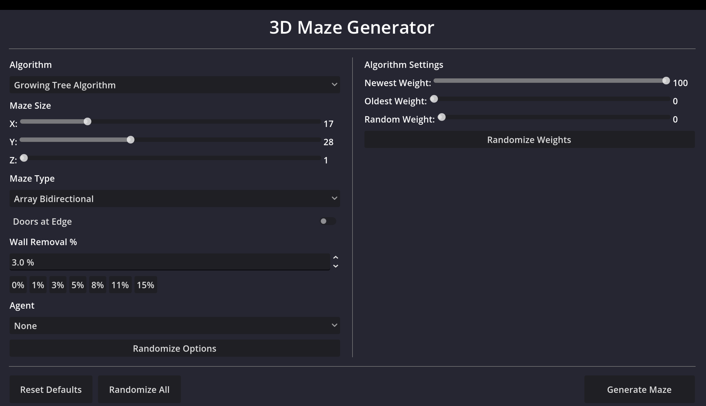
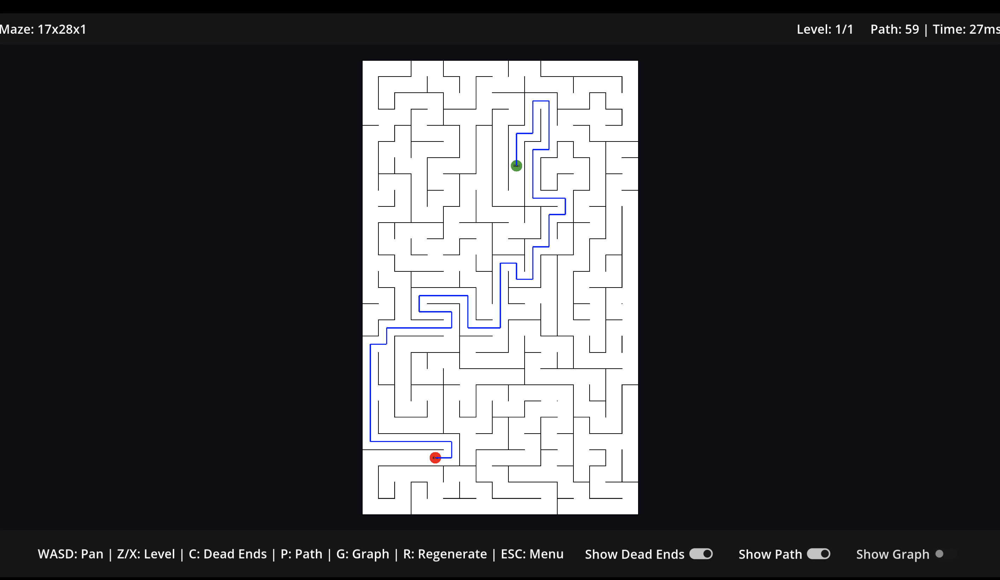

# Procedural 3D Maze Generator

A procedural maze generation system built with **Godot 4** and **C#**, featuring multiple algorithms, 3D maze support, and interactive visualization.



## Features

- **Multiple Algorithms**: Growing Tree, Recursive Backtracker, Binary Tree
- **3D Maze Support**: Generate multi-level mazes with stairs between floors
- **Configurable Generation**: Adjust weights, size, extra walls, and more
- **Path Visualization**: Display the shortest path solution
- **Dead End Hiding**: Toggle visibility of dead-end corridors
- **AI Agents**: Perfect and Random maze-solving agents
- **Comprehensive Test Suite**: 120 tests with 90% code coverage

## Requirements

- [Godot 4.x](https://godotengine.org/) with .NET support
- [.NET 8 SDK](https://dotnet.microsoft.com/download)

## Quick Start

### Running in Godot

1. Clone the repository
2. Open the project in Godot 4
3. Press F5 to run

### Building from Command Line

```bash
dotnet build
```

### Running Tests

Run all tests:

```bash
cd tests
dotnet test --blame-hang-timeout 60s
```

Run with coverage:

## Controls

### Tile View

| Key | Action |
|-----|--------|
| WASD / Arrow Keys | Pan camera |
| Q / E | Zoom out / in |
| Mouse Wheel | Zoom in/out |
| Z / X | Navigate levels (3D mazes) |
| P | Toggle path display |
| G | Toggle graph display |
| V | Switch to Graph View |
| C | Toggle dead ends |
| R | Regenerate maze |
| H | Toggle controls panel |
| ESC | Return to menu |

### Graph View

| Key | Action |
|-----|--------|
| WASD | Pan camera |
| Q / E | Zoom out / in |
| N / B | Cycle through alternative paths |
| M | Toggle all paths simultaneously |
| T | Toggle animation mode |
| J | Cycle decision point detail (Off/Badges/Detailed) |
| V | Switch to Tile View |

### Animation Mode (Graph View)

| Key | Action |
|-----|--------|
| Space | Play/pause animation |
| < / > | Step backward/forward |
| + / - | Increase/decrease speed |
| T | Exit animation mode |

## Project Structure

```
├── scripts/
│   ├── autoload/         # GameState, ServiceContainer (DI)
│   ├── maze/
│   │   ├── model/        # MazePoint, Direction, MazeCell
│   │   ├── generation/   # Algorithms (GrowingTree, Backtracker)
│   │   ├── solver/       # Graph, ShortestPathSolver
│   │   ├── agents/       # PerfectAgent, RandomAgent
│   │   └── factory/      # MazeFactory, MazeGenerationFactory
│   └── ui/               # MenuUI, MazeMain, MazeLoaderUI
├── scenes/               # Godot scene files
├── resources/            # Sprites and assets
├── tests/                # NUnit test project
└── ProceduralGeneration3DMazes.sln
```

## Algorithms

### Growing Tree Algorithm

The primary algorithm with configurable cell selection:

- **Newest Weight**: Creates long, winding corridors (like recursive backtracker)
- **Oldest Weight**: Creates shorter, more branching paths
- **Random Weight**: Creates balanced, organic mazes

### Recursive Backtracker

Classic depth-first maze generation. Equivalent to Growing Tree with 100% Newest Weight.

### Binary Tree Algorithm

Simple algorithm with diagonal bias.

## API Usage

### Generate a Maze

```csharp
var services = new ServiceContainer();
var settings = new MazeGenerationSettings
{
    Algorithm = Algorithm.GrowingTreeAlgorithm,
    Size = new MazeSize { X = 20, Y = 20, Z = 1 },
    Option = MazeType.DirectedMaze,
    GrowingTreeSettings = new GrowingTreeSettings
    {
        NewestWeight = 75,
        OldestWeight = 0,
        RandomWeight = 25
    }
};

var result = services.MazeGenerationFactory.GenerateMaze(settings);
var shortestPath = result.HeuristicsResults.ShortestPathResult.ShortestPath;
```

### Navigate the Maze

```csharp
var jumper = result.MazeJumper;
jumper.JumpToPoint(jumper.StartPoint);

foreach (var direction in jumper.GetsDirectionsFromPoint())
{
    if (jumper.CanMoveInDirection(direction))
    {
        jumper.MoveInDirection(direction);
        break;
    }
}
```

## Test Coverage

| Metric | Coverage |
|--------|----------|
| Line | 90.65% |
| Branch | 79.81% |
| Method | 92.08% |

Run with coverage:

```bash
cd tests
dotnet test /p:CollectCoverage=true /p:CoverletOutputFormat=cobertura
```

## Legacy Unity Version

The original Unity implementation is preserved on the [`unity-legacy`](../../tree/unity-legacy) branch for historical reference.

## License

[MIT License](LICENSE)

## Screenshots

### Menu


### Maze View

